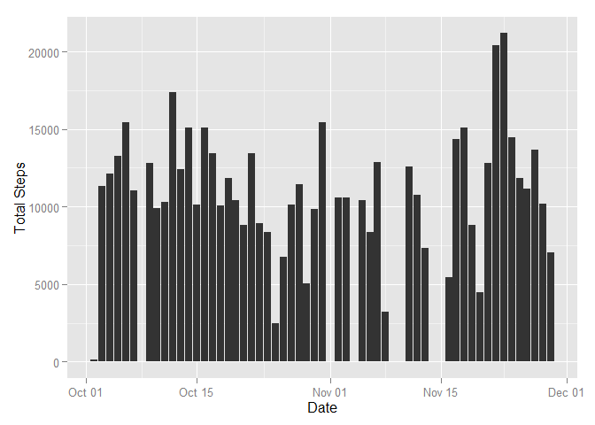
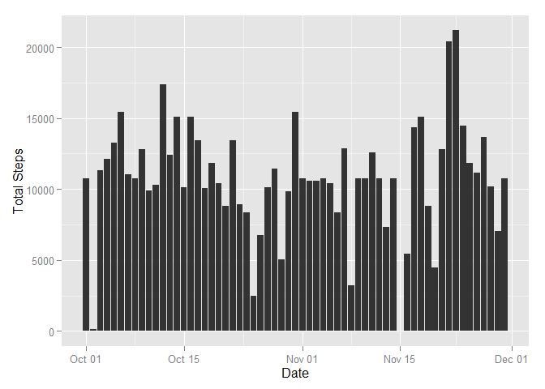
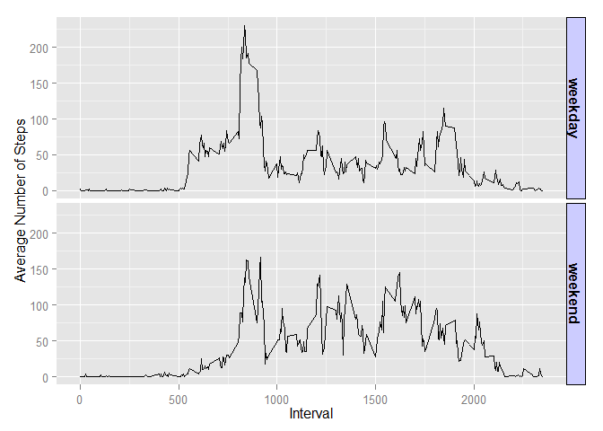

# Reproducible Research: Peer Assessment 1


## Loading and preprocessing the data
Use the following code to extract and load the data.

```r
rawdata <- read.csv(unz("activity.zip", "activity.csv"))
rawdata$date <- as.Date(rawdata$date)
```


## What is mean total number of steps taken per day?

To calculate the mean total number of steps taken per day, we
have to remove the NAs from the data.

```r
data <- rawdata[complete.cases(rawdata),]
paste(nrow(rawdata) - nrow(data), " rows removed")
```

```
## [1] "2304  rows removed"
```

Next, we have to total the number of step taken per day.

```r
library(dplyr)
```

```
## 
## Attaching package: 'dplyr'
## 
## The following object is masked from 'package:stats':
## 
##     filter
## 
## The following objects are masked from 'package:base':
## 
##     intersect, setdiff, setequal, union
```

```r
result <- data %>% 
  group_by(date) %>%
  summarize(totalsteps = sum(steps))
head(result)
```

```
## Source: local data frame [6 x 2]
## 
##         date totalsteps
## 1 2012-10-02        126
## 2 2012-10-03      11352
## 3 2012-10-04      12116
## 4 2012-10-05      13294
## 5 2012-10-06      15420
## 6 2012-10-07      11015
```

Graph the results

```r
library(ggplot2)
ggplot(data=result, aes(x=date, y=totalsteps)) + geom_bar(stat="identity") +
   xlab("Date") +
   ylab("Total Steps")
```

 

Calculate the mean of the total number of steps taken per day.

```r
mean(result$totalsteps)
```

```
## [1] 10766.19
```

Calculate the median of the total number of steps taken per day.

```r
median(result$totalsteps)
```

```
## [1] 10765
```

## What is the average daily activity pattern?
Plot the average steps per interval accross all days.

```r
result <- data %>% 
     group_by(interval) %>%
     summarize(meansteps = mean(steps))
plot(result$interval, 
     result$meansteps, 
     type="l", 
     xlab="Interval", 
     ylab="Average Steps")
```

 

The interval of the max is as follows

```r
as.numeric(result[result$meansteps == max(result$meansteps),"interval"])
```

```
## [1] 835
```

## Imputing missing values
Make sure steps is the only column that has NA values.

```r
sum(is.na(rawdata$date))
```

```
## [1] 0
```

```r
sum(is.na(rawdata$interval))
```

```
## [1] 0
```

The total number of missing values in the dataset is 

```r
sum(is.na(rawdata$steps))
```

```
## [1] 2304
```


To illustrate why imputing data into the dataset may change the data's statistical characteristics, we will impute the mean of each interval where steps for that interval equals `NA`s.

```r
dataImputed <- rawdata
dataImputed$steps[is.na(dataImputed$steps)] <- with(dataImputed, ave(steps, interval,                                      FUN = function(x) mean(x, na.rm = TRUE)))[is.na(dataImputed$steps)]
```


Create a histogram of total number of steps taken each day.

```r
totalsteps <- dataImputed %>% 
  group_by(date) %>%
  summarize(totalsteps = sum(steps))

ggplot(data=totalsteps, aes(x=date, y=totalsteps)) + geom_bar(stat="identity") +
   xlab("Date") +
   ylab("Total Steps")
```

 

Calculate the mean and median to compare to earlier analysis

```r
# Mean
mean(totalsteps$totalsteps)
```

```
## [1] 10766.19
```

```r
# Median
median(totalsteps$totalsteps)
```

```
## [1] 10766.19
```

The impact of imputing missing data on the estimates of the total daily number of steps is that the resulting characteristics are effected. For example, the median has changed from the original dataset.

## Are there differences in activity patterns between weekdays and weekends?

Determine if the date is a weekday or a weekend.

```r
dataDayTypes <- mutate(dataImputed,
                  daytype = ifelse(weekdays(date) == "Saturday" | weekdays(date) == "Sunday", "weekend", "weekday"))

dataDayTypeMeans <- dataDayTypes %>% 
     group_by(interval, daytype) %>%
     summarize(
       dayTypeMean = mean(steps)
     )

ggplot(dataDayTypeMeans, aes(x=interval, y=dayTypeMean)) +
  geom_line() +
  facet_grid(daytype ~ .) +
  theme(strip.text.y = element_text(size=12, face="bold"),
        strip.background = element_rect(colour="black", fill="#CCCCFF")) +
  xlab("Interval") +
  ylab("Average Number of Steps")
```

 

